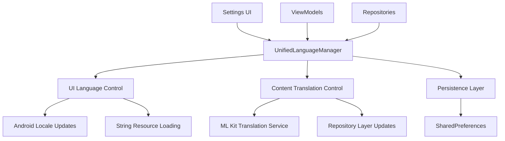

# Design Document

## Overview

The unified language system will merge the current `LanguageManager` (UI) and `ContentManager` (API content) into a single, cohesive language management solution. This design eliminates the confusion of having separate language settings and provides a seamless user experience where selecting a language affects both the interface and content consistently.

## Architecture

### Current State Analysis

Currently, the app has two separate language management systems:
- **LanguageManager**: Handles UI language changes and Android locale updates
- **ContentManager**: Manages API content language and triggers ML Kit translations

### Proposed Unified Architecture



## Components and Interfaces

### 1. UnifiedLanguageManager

**Purpose**: Single source of truth for language management across the entire app.

**Key Responsibilities**:
- Manage current language state
- Coordinate UI locale changes
- Trigger content translation
- Persist language preferences
- Notify observers of language changes

**Interface**:
```kotlin
object UnifiedLanguageManager {
    val currentLanguage: StateFlow<String>
    
    fun init(context: Context)
    fun setLanguage(context: Context, languageCode: String)
    fun getAvailableLanguages(context: Context): List<Language>
    fun applyLanguageToUI(context: Context, languageCode: String)
    fun cleanup()
}
```

### 2. Language Data Model

**Purpose**: Represent available languages with display information.

```kotlin
data class Language(
    val code: String,           // "es", "en"
    val displayName: String,    // "Español", "English"
    val flag: String,          // "🇪🇸", "🇺🇸"
    val isDefault: Boolean = false
)
```

### 3. Translation Coordinator

**Purpose**: Coordinate between UI updates and content translation.

**Interface**:
```kotlin
interface TranslationCoordinator {
    suspend fun applyLanguageChange(languageCode: String)
    fun notifyViewModelsOfLanguageChange()
    fun updateUILocale(context: Context, languageCode: String)
}
```

### 4. Updated Settings UI

**Purpose**: Provide a single, intuitive language selection interface.

**Components**:
- Single "Language" section (removing separate UI/Content sections)
- Language list with native names and flags
- Current selection indicator
- Immediate preview of changes

## Data Models

### Language State Management

```kotlin
// Unified language state
data class LanguageState(
    val currentLanguage: String,
    val isTranslating: Boolean = false,
    val availableLanguages: List<Language>
)

// Language change events
sealed class LanguageEvent {
    data class LanguageChanged(val newLanguage: String) : LanguageEvent()
    object TranslationStarted : LanguageEvent()
    object TranslationCompleted : LanguageEvent()
    data class TranslationFailed(val error: String) : LanguageEvent()
}
```

### Persistence Schema

```kotlin
// SharedPreferences keys
object LanguagePrefs {
    const val PREFS_NAME = "unified_language_prefs"
    const val KEY_CURRENT_LANGUAGE = "current_language"
    const val DEFAULT_LANGUAGE = "es"
}
```

## Error Handling

### Translation Failures
- **Graceful Degradation**: If ML Kit translation fails, content remains in Spanish
- **User Notification**: Subtle indicator that translation is unavailable
- **Retry Mechanism**: Automatic retry on network recovery

### UI Update Failures
- **Fallback Locale**: If locale update fails, maintain current UI language
- **State Consistency**: Ensure language state remains consistent even if partial updates fail

### Network Connectivity
- **Offline Mode**: UI language changes work offline, content translation queued for when online
- **Model Download**: Handle ML Kit model download failures gracefully

## Testing Strategy

### Unit Tests
- **UnifiedLanguageManager**: Test language state management and persistence
- **TranslationCoordinator**: Test coordination between UI and content updates
- **Language Data Models**: Test data validation and transformation

### Integration Tests
- **End-to-End Language Change**: Test complete flow from settings to UI/content update
- **Persistence**: Test language preference saving and restoration
- **Translation Flow**: Test ML Kit integration and fallback scenarios

### UI Tests
- **Settings Screen**: Test language selection interface
- **Language Application**: Test that selected language applies to all screens
- **Loading States**: Test translation loading indicators

### Performance Tests
- **Language Switch Speed**: Measure time from selection to complete application
- **Memory Usage**: Monitor memory impact of maintaining translation state
- **Translation Caching**: Test efficiency of translation result caching

## Migration Strategy

### Phase 1: Create Unified Manager
1. Create `UnifiedLanguageManager` with combined functionality
2. Maintain backward compatibility with existing managers
3. Add comprehensive unit tests

### Phase 2: Update UI Components
1. Modify Settings screen to use single language selection
2. Update all ViewModels to observe unified language state
3. Remove duplicate language-related UI components

### Phase 3: Repository Integration
1. Update repositories to use unified language state
2. Ensure translation triggers work with new system
3. Test end-to-end functionality

### Phase 4: Cleanup and Optimization
1. Remove old `LanguageManager` and `ContentManager`
2. Clean up unused code and dependencies
3. Optimize performance and memory usage

### Phase 5: Testing and Validation
1. Comprehensive testing across all scenarios
2. Performance validation
3. User experience validation

## Implementation Considerations

### Reactive Programming
- Use Kotlin Flow for language state management
- Ensure all components react automatically to language changes
- Minimize manual state synchronization

### Performance Optimization
- Cache translation results to avoid repeated API calls
- Lazy load language resources
- Optimize UI update batching

### Accessibility
- Ensure language changes are announced to screen readers
- Maintain proper content descriptions in all languages
- Support right-to-left languages if needed in future

### Backwards Compatibility
- Migrate existing user preferences seamlessly
- Ensure no data loss during transition
- Provide fallback for edge cases during migration