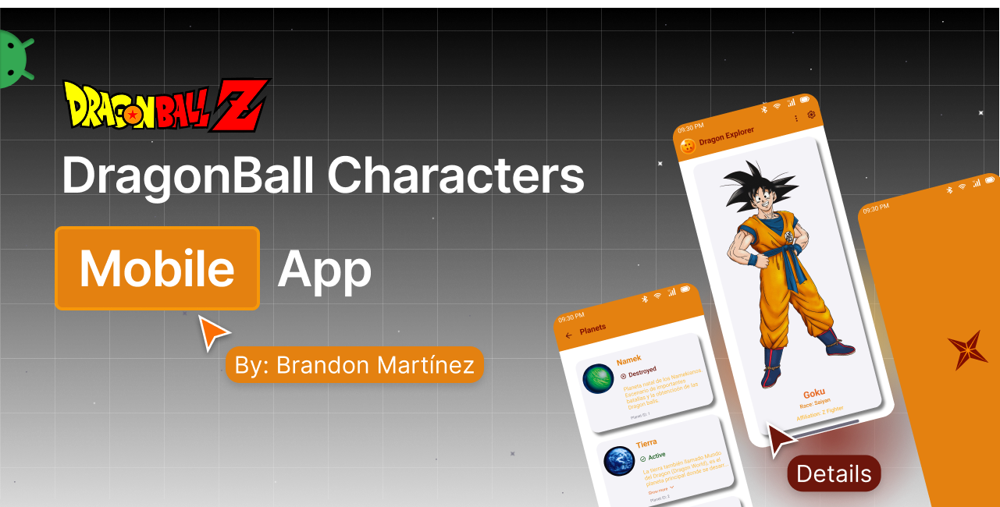

<p align="center">
  <a href="https://github.com/BR444N/dragonball-api-mobile-app/blob/main/LICENSE">
    
  </a>
  
  
</p>

# 🐉 Dragonball-Characters-Mobile-App
Mobile application developed in Kotlin using Jetpack Compose for the user interface. This project consumes the Dragon Ball API to display relevant information about characters, their transformations, and other data from the Dragon Ball universe. The app includes features such as screen navigation, light/dark theme, and language support.


# ✨ App Features

- 🎨 **Theming**: The app supports both **light** and **dark themes**, allowing users to choose their preferred visual style.  
- 🌍 **Multilingual Support**: Includes support for **multiple languages**, which users can change directly in the settings.  
- 🚨 **Custom Error Handling**: Features a custom UI for **network errors**, including a **"Reload" button**.  
- 🎞️ **Lottie Animations**: Uses **Lottie** for smooth and engaging loading spinners.  
- 💡 **UI Tooltips**: Provides helpful **tooltips** on TopAppBar buttons to guide users.  
- ♿ **Accessibility**: Includes **descriptions for UI elements** to support screen readers and other accessibility features.    
- 📱 **Adaptive Design**: The UI is designed to **adapt to different screen sizes and orientations**.

# ⚙⬇️ Download

```bash
git clone https://github.com/BR444N/dragonball-api-mobile-app.git
```

# 📦 Stack

- **Jetpack Compose**:
- **Kotlin**:
- **ML Kit**:
- **Lottie**:
- **Material Design 3**:
- **API**: 
