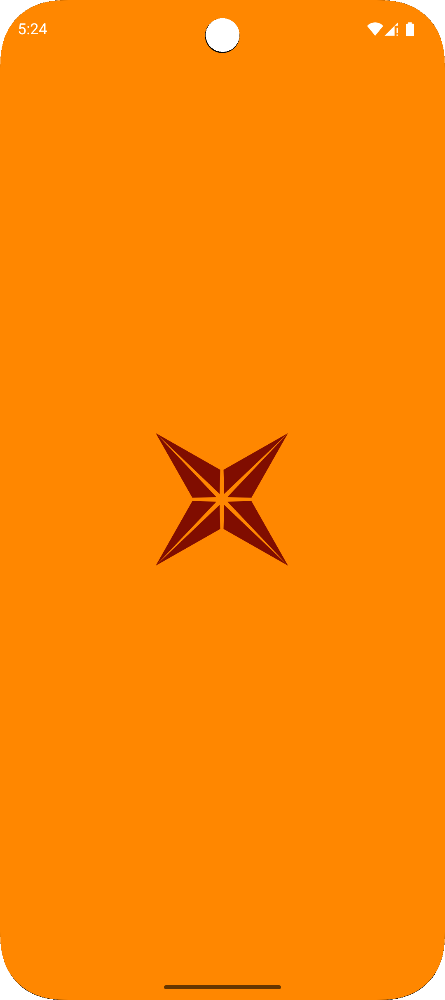
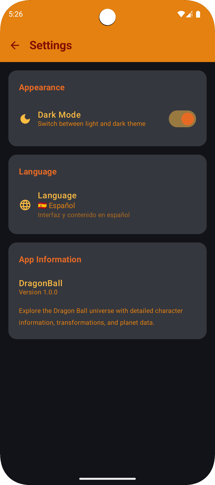
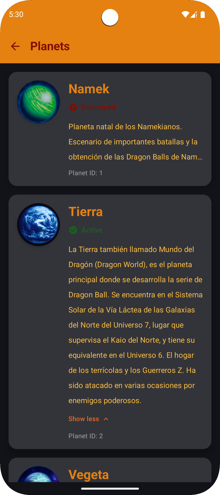

<p align="center">
  <a href="https://github.com/BR444N/dragonball-api-mobile-app/blob/main/LICENSE">
    
  </a>
  <a href="https://github.com/BR444N/dragonball-api-mobile-app/releases">
    
  </a>
  <a href="https://github.com/BR444N/dragonball-api-mobile-app/blob/main/app/build.gradle">
    
  </a>
  <a href="https://github.com/BR444N/dragonball-api-mobile-app/blob/main/app/build.gradle">
    
  </a>
  <a href="https://github.com/BR444N/dragonball-api-mobile-app/blob/main/app/build.gradle">
    
  </a>
</p>

# 🐉 Dragonball-Characters-Mobile-App
Mobile application developed in Kotlin using Jetpack Compose for the user interface. This project consumes the Dragon Ball API to display relevant information about characters, their transformations, and other data from the Dragon Ball universe. The app includes features such as screen navigation, light/dark theme, and language support.

# 📖 About the API
This mobile app consumes the [Dragon Ball API](https://web.dragonball-api.com/) to display characters and their transformations.

**API Documentation:** https://web.dragonball-api.com/documentation

<p align="center">
  

  
</p>

# ✨ App Features

- 🎨 **Theming**: The app supports both **light** and **dark themes**, allowing users to choose their preferred visual style.  
- 🌍 **Multilingual Support**: Includes support for **multiple languages**, which users can change directly in the settings.  
- 🚨 **Custom Error Handling**: Features a custom UI for **network errors**, including a **"Reload" button**.  
- 🎞️ **Lottie Animations**: Uses **Lottie** for smooth and engaging loading spinners.  
- 💡 **UI Tooltips**: Provides helpful **tooltips** on TopAppBar buttons to guide users.  
- ♿ **Accessibility**: Includes **descriptions for UI elements** to support screen readers and other accessibility features.    
- 📱 **Adaptive Design**: The UI is designed to **adapt to different screen sizes and orientations**.

# 📦 Stack

- **Jetpack Compose**: Modern toolkit for building native UI with declarative syntax.
- **Kotlin**: Primary programming language for concise and safe code.
- **ML Kit**: Integrated machine learning features for on-device text translation.
- **Lottie**: Lightweight library for displaying high-quality animations, including smooth loading animations.
- **Material Design 3**: Material Design 3 for modern, adaptive, and accessible visual components.
- **Retrofil & GSON**: Retrofit y GSON para consumir la API REST.

# 📸 Screenshots

<div align="center">

### Navigation Guide:
**Click on any screenshot to view it in a full size.**


  



</div>

---

## 📋 Detailed Descriptions

### 1. 💫 Splash Screen
**File:** `splashScreen.png`  
The first screen users see when opening the application. Displays the app logo and brand identity during initial loading.

### 2. 🏠 Main Screen  
**File:** `infoCharacter.png`  
The main screen to view and navigate through Dragon Ball character cards with brief information. This is the home dashboard of the application.

### 3. ⚙️ Settings Menu
**File:** `settings.png`  
A detailed view of configurable settings including theme selection and language switching between English and Spanish.

### 4. 📝 Planets Card
**File:** `viewPlanets.png`  
The interface to view the details of planets from the Dragon Ball world, showing planetary characteristics and information.

# ⬇️ Download

```bash
git clone https://github.com/BR444N/dragonball-api-mobile-app.git
```

1. Open the project in the latest version of Android Studio.

2. Wait for Gradle to sync all dependencies.

3. Run the application on an emulator or physical device.


# 🙋‍♂️ Autor
[BR444N](https://github.com/BR444N)
